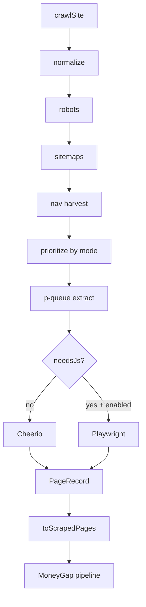

# Architecture

## Modules

| Path | Responsibility |
|------|----------------|
| `discovery/` | URL normalize, classify, prioritize |
| `robots/` | robots.txt allow + crawl-delay + sitemap hints |
| `sitemaps/` | XML urlset + sitemap index parsing |
| `queue/` | In-memory states + exponential backoff |
| `renderers/` | Static fetch + optional Playwright |
| `framework-detectors/` | JS-framework heuristics / needsJs |
| `extractors/` | Cheerio → PageRecord + markdown |
| `adapters/` | PageRecord → ScrapedPage |
| `cache/` | Short TTL robots/sitemap cache |
| `progress/` | Live progress events |
| `worker.ts` | Deep Scan Postgres poller |

## Flow

## Compatibility

Do not change `ScrapedPage` or `buildCrawlCorpus` consumers without a migration plan. Engine modules read corpus strings, not raw page arrays.

## Performance

- Prefer Cheerio; keep Playwright rare
- Cap `maxPages` and `maxRuntimeMs` on serverless
- Stream: do not keep full HTML arrays after extract
- Close Playwright contexts after each page; close browser at crawl end

## Extension

1. Add a detector in `framework-detectors`
2. Add prioritization patterns in `discovery/prioritize.ts`
3. Map new metadata in `adapters/scraped-page.ts`
